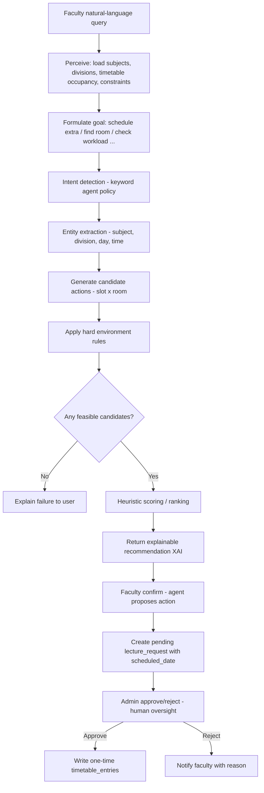
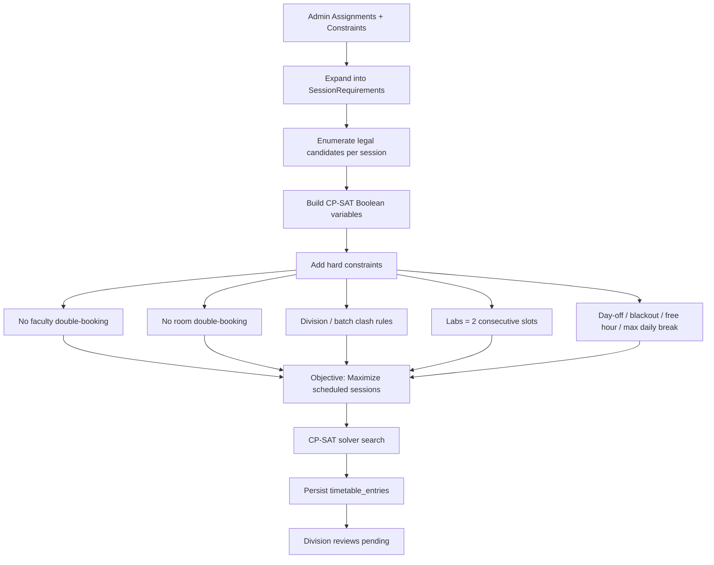
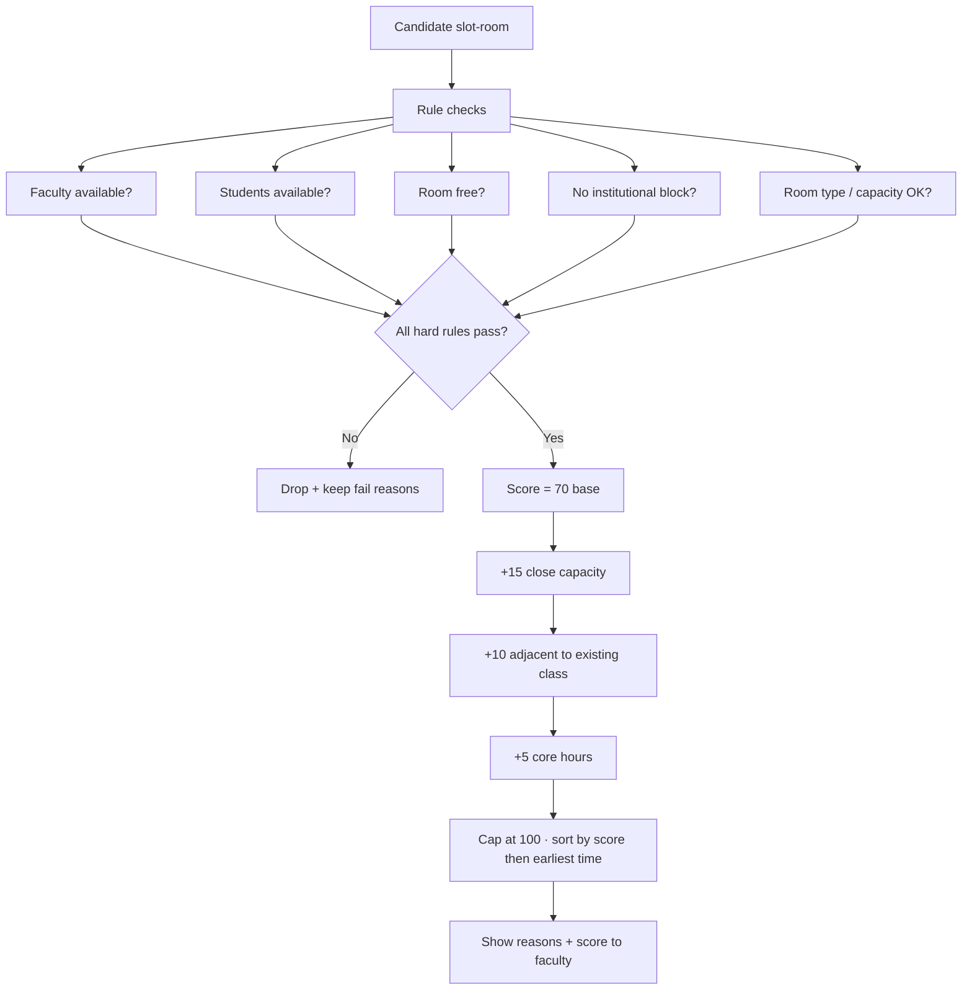
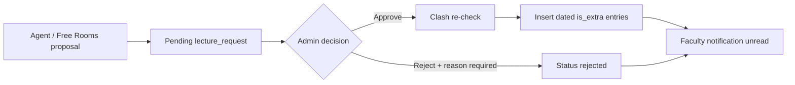

# SmartSched AI — Project Documentation (Guide Review Pack)

**Document purpose:** Abstract through syllabus mapping, with feature–tech mapping and exact code locations for viva / project-guide review.

**Related docs:** [`readme.md`](./readme.md) (full system overview) · [`backend/README.md`](./backend/README.md) · [`frontend/README.md`](./frontend/README.md)

---

## Table of Contents

1. [Abstract](#1-abstract)
2. [Problem Statement](#2-problem-statement)
3. [Proposed Solution](#3-proposed-solution)
4. [Tech Stack](#4-tech-stack)
5. [Features and Tech Stack Mapping](#5-features-and-tech-stack-mapping)
6. [Syllabus Topics Used in SmartSched AI](#6-syllabus-topics-used-in-smartsched-ai)
7. [Syllabus Flowcharts (Step-by-Step)](#7-syllabus-flowcharts-step-by-step)
8. [Code Locations for Guide Review](#8-code-locations-for-guide-review)

---

## 1. Abstract

SmartSched AI is a full-stack intelligent academic scheduling platform designed for college timetable generation and mid-term schedule adjustments. Manual timetable creation is slow, clash-prone, and difficult to rebalance when faculty request extra or replacement lectures. SmartSched AI addresses this with two complementary engines: (1) a **Constraint Programming (CP-SAT)** timetable generator that produces clash-free weekly schedules under institutional rules, and (2) a **rule-based Smart Scheduling Assistant** that interprets faculty requests, checks availability, and returns explainable ranked recommendations. All mid-term bookings are **date-specific and one-time**, require **admin approval**, and are reflected in faculty/admin views with clear visual markers (for example, yellow highlighting for extra lectures). The system also provides Free Rooms discovery, notifications, analytics, and Excel export. The assistant is deliberately **not** an LLM chatbot: intent detection, entity extraction, hard-rule checks, and scoring are deterministic, testable, and explainable.

---

## 2. Problem Statement

Colleges typically build and maintain timetables using spreadsheets or static editors. This creates several concrete problems:

1. **Clash risk:** Faculty, classrooms/labs, and divisions can be double-booked without systematic global checking.
2. **Constraint complexity:** Real rules include free hours, day-offs/blackouts, lab double-slots, online sessions, and limits on student idle gaps — hard to enforce manually.
3. **Poor mid-term flexibility:** Extra or replacement lectures are often arranged informally; rooms may already be taken; students/faculty may conflict.
4. **Opaque “AI” tools:** Black-box recommenders give a slot without reasons; institutions need auditability and admin control.
5. **Weekly vs one-time confusion:** An “extra Monday 10–11” should usually be a **single dated occurrence**, not a permanent weekly class — legacy tools rarely model this correctly.

SmartSched AI must therefore generate a valid base timetable **and** support controlled, explainable, date-aware adjustments with human approval.

---

## 3. Proposed Solution

SmartSched AI proposes a two-pillar architecture:

### Pillar A — AI Timetable Optimization Engine
- Admin maintains master data (faculty, subjects, rooms, divisions, assignments, constraints).
- On **Generate**, the system expands assignments into session requirements and solves with **Google OR-Tools CP-SAT**.
- Hard constraints prevent faculty/room/division clashes; labs occupy two consecutive slots; institutional rules (free hour, day-off/blackout, max daily break) are enforced.
- Output is persisted as `timetable_entries` and reviewed **per division** (approve/reject).

### Pillar B — Rule-Based Smart Scheduling Assistant + Free Rooms
- Faculty ask in natural language (e.g. “Schedule an extra CB2005 lecture for SY-A”) or use the **Free Rooms** date grid.
- The assistant detects intent, extracts entities, filters illegal candidates with hard rules, and ranks feasible slots with an explainable score.
- Confirm / Reserve creates a **pending** `lecture_request` with a **scheduled_date** (one-time).
- Admin approve/reject (reject requires reason); approve writes dated `timetable_entries` (`is_extra=true`) and notifies faculty.
- Labs are suggested/booked only when **two continuous hours** are free; one-hour free labs are shown with a warning and blocked for lab reservation.

### Governance & UX
- JWT RBAC (`admin` | `faculty`), unread indicators, yellow extra-lecture markers, subject codes, year-division labels, Excel export, analytics from real DB metrics.

---

## 4. Tech Stack

| Layer | Technology |
|---|---|
| Frontend | Next.js 15 (App Router) · TypeScript · MUI · Axios · React Hook Form · Zod · TanStack Query · SheetJS (`xlsx`) · Vitest |
| Backend | Python ≥ 3.10 · FastAPI · Uvicorn · Pydantic · SQLAlchemy 2 · PyMySQL |
| Database | MySQL 8 |
| Auth | JWT (python-jose) · bcrypt · RBAC |
| Optimization | Google OR-Tools **CP-SAT** |
| Assistant | Deterministic intent + entity extract + rule engine + heuristic scoring (**no LLM**) |
| Tooling | pytest · ESLint · Prettier · Husky |

> Explicit non-goals vs syllabus Units 5–6: no BERT/GPT, no computer vision, no Azure/AWS SageMaker deployment in the current build.

---

## 5. Features and Tech Stack Mapping

| Feature | What it does | Primary tech used |
|---|---|---|
| Login / RBAC | Admin vs Faculty access | JWT · FastAPI deps · Next.js middleware · cookies |
| Admin dashboard | Live counts | FastAPI · SQLAlchemy · TanStack Query · MUI |
| Faculty / Subjects / Rooms / Divisions CRUD | Master data | FastAPI CRUD · MySQL · React Hook Form · Zod |
| Assignments | Optimizer input (who teaches what) | SQLAlchemy · FastAPI · MUI tables |
| Constraints config | Institutional JSON rules | MySQL JSON · constraint service · Admin UI |
| Timetable generation | Clash-free weekly grid | **OR-Tools CP-SAT** · `optimizer.py` · TimetableService |
| Division review | Approve/reject generated grid | Review service · notifications · Admin Timetable UI |
| Faculty weekly / today schedule | Personal views | Schedule service · TimetableGrid · React Query |
| Subject code + year-division labels | Clear cell identity | API denormalization · TimetableGrid |
| Extra lecture yellow highlight | Mark ad-hoc classes | `is_extra` column · theme warning color · TimetableGrid |
| Smart Assistant | NL query → ranked explainable slot | intent_engine · entity_extractor · rule_engine · recommender · AssistantService |
| Assistant confirm | Pending one-time request | Assistant confirm API · `scheduled_date` · lecture_requests |
| Free Rooms | Date grid of free rooms; reserve form | RoomAvailabilityService · Free Rooms page · date picker |
| Lecture request approval | Approve/reject + reason | LectureRequestService · Admin Requests · notifications |
| Unread dots | Pending requests / unread notifications | Sidebar badges · polling queries |
| Workload | Hours vs max weekly | ScheduleService metrics · Faculty Workload page |
| Analytics | Utilization / idle / assistant usage | AnalyticsService · Admin Analytics |
| Excel export | Download timetable | SheetJS (`xlsx`) · export helper |
| Notifications | Approve/reject/review alerts | NotificationService · Faculty Notifications page |

---

## 6. Syllabus Topics Used in SmartSched AI

Mapping against **SECTION I** of the AI syllabus (honest scope — not claiming Units 4–6 GenAI/Cloud).

| Syllabus topic (Unit) | How it appears in SmartSched AI |
|---|---|
| **Definition of AI / Intelligent Agents** (Unit 1) | Smart Assistant is a **goal-based agent**: perceive query + DB state → choose best feasible (slot, room) → propose action (pending request) |
| **Human vs Machine Intelligence** (Unit 1) | Machine proposes optimized/feasible options; **humans (admin)** remain decision-makers for final approval |
| **Agent environments** (Unit 1) | Partially observable college environment: rooms, slots, constraints, current timetable, date-specific occupancy |
| **Problem formulation** (Unit 1) | Timetable = assign sessions to legal (slot[, consecutive lab slot], room) under hard constraints |
| **State-space representation** (Unit 1) | Each session has a discrete candidate set; CP-SAT chooses a feasible combination across all sessions |
| **Uninformed vs Informed Search** (Unit 1–2, conceptual) | Full timetable uses **constraint search/optimization (CP-SAT)**, not hand-coded BFS/DFS/A*. Assistant uses **informed heuristic ranking** of already-feasible candidates |
| **Ethical / Responsible AI** (Unit 1) | No silent overwrite of live schedule; admin approval; rejection reasons; audit via request logs |
| **Explainable AI (XAI)** (Unit 1) | Pass/fail rule labels + numeric score shown before faculty confirms |
| **Optimization via search** (Unit 2, related) | Maximize number of successfully scheduled sessions under constraints (partial schedule preferred over total failure) |
| **Knowledge representation (lightweight)** (Unit 3) | Domain knowledge stored as typed constraints + rule predicates (“faculty free?”, “room capacity ≥ strength?”) — **not** FOL/Neo4j/OWL |
| **Inference (rule application)** (Unit 3, lightweight) | Forward application of hard rules to each candidate; only passers enter ranking |

### Topics intentionally **not** claimed

BFS/DFS/UCS/A*/Minimax/Alpha-Beta · Genetic/swarm algorithms · FOL/Resolution/SPARQL · MDP/STRIPS · Transformers/BERT/GPT · Computer Vision · Cloud AI (SageMaker/Vertex/Azure ML)

---

## 7. Syllabus Flowcharts (Step-by-Step)

### 7.1 Intelligent Agent loop (Smart Assistant) — Unit 1

**Reading for guide:** The assistant does not “chat freely”; it is an agent with a fixed policy over a structured environment, ending in a human-governed action.

---

### 7.2 Problem formulation → CP-SAT optimization — Units 1–2

**Reading for guide:** This is the project’s primary “search/optimization” story — constraint-based search rather than classical BFS/A*.

---

### 7.3 Explainable recommendation pipeline — Unit 1 XAI + Unit 2 heuristics

---

### 7.4 Responsible / human-in-the-loop path — Unit 1 ethics

---

## 8. Code Locations for Guide Review

Use these paths when demonstrating syllabus topics live in the IDE.

### 8.1 Intelligent Agent + Assistant pipeline (Unit 1)

| Concept | File | What to show |
|---|---|---|
| Intent detection (agent policy) | `backend/app/scheduling/assistant/intent_engine.py` | `detect_intent()` keyword rules |
| Entity extraction | `backend/app/scheduling/assistant/entity_extractor.py` | subject / division / day / time extractors |
| Hard rule checks (environment constraints) | `backend/app/scheduling/assistant/rule_engine.py` | `check_candidate()` |
| Heuristic scoring (informed ranking) | `backend/app/scheduling/assistant/recommender.py` | `score_candidate()`, `rank_candidates()` |
| Agent orchestration | `backend/app/services/assistant_service.py` | `handle_query()`, `_handle_schedule_request()`, `confirm_booking()` |
| HTTP entrypoints | `backend/app/api/v1/routers/faculty_assistant.py` | `POST /query`, `POST /confirm` |
| Faculty UI | `frontend/src/app/faculty/assistant/page.tsx` | recommendation card, reasons, score, confirm |

### 8.2 Problem formulation + CP-SAT optimization (Units 1–2)

| Concept | File | What to show |
|---|---|---|
| Session / candidate model | `backend/app/scheduling/optimizer.py` | `SessionRequirement`, `_build_candidates()`, `generate_timetable()` |
| Max daily break constraints | `backend/app/scheduling/optimizer.py` | `_add_max_daily_break_constraints()` |
| Shared institutional constraints | `backend/app/scheduling/constraints.py` | blocked slots, day-off/blackout, max daily break config |
| DB → optimizer adapter | `backend/app/services/timetable_service.py` | `generate()`, persist entries |
| Admin generate UI | `frontend/src/app/admin/timetable/page.tsx` | Generate button + reviews |

### 8.3 Explainable AI / Responsible AI (Unit 1)

| Concept | File | What to show |
|---|---|---|
| Reasons returned to client | `backend/app/schemas/assistant.py` | `ReasonOut`, `RecommendationOut` |
| Pending approval (no silent write) | `backend/app/services/assistant_service.py` | `confirm_booking()` creates `LectureRequest`, not live entry |
| Approve / reject + reason | `backend/app/services/lecture_request_service.py` | `resolve_request()` |
| Admin reject UI | `frontend/src/app/admin/requests/page.tsx` | mandatory rejection reason dialog |
| Faculty notification of outcome | `backend/app/services/lecture_request_service.py` | `_notify_resolution()` |

### 8.4 Knowledge as constraints / rule inference (Unit 3 lightweight)

| Concept | File | What to show |
|---|---|---|
| Constraint types in schema | `backend/app/models/constraint.py` | `ConstraintType` enum |
| Constraint loading | `backend/app/scheduling/constraints.py` | `get_blocked_slot_ids()`, `get_division_blocked_slot_ids()` |
| Reject-reason → suggested constraint | `backend/app/scheduling/constraint_suggester.py` | `suggest_constraint_from_reason()` |
| Admin constraints UI | `frontend/src/app/admin/constraints/page.tsx` | JSON config CRUD |

### 8.5 Date-specific Free Rooms (product feature supporting the agent environment)

| Concept | File | What to show |
|---|---|---|
| Availability + validation | `backend/app/services/room_availability_service.py` | `free_rooms()`, `validate_reservation()` |
| Faculty Free Rooms API | `backend/app/api/v1/routers/faculty_free_rooms.py` | `GET ""`, `POST /reserve` |
| Faculty UI | `frontend/src/app/faculty/free-rooms/page.tsx` | date picker, room chips, reserve form |
| One-time date columns | `database/migrations/015_date_specific_extra_lectures.sql` | `scheduled_date` on requests & entries |

### 8.6 Extra-lecture visualization (UX of agent outcomes)

| Concept | File | What to show |
|---|---|---|
| `is_extra` model | `backend/app/models/timetable_entry.py` | `is_extra` field |
| Yellow rendering | `frontend/src/components/timetable/TimetableGrid.tsx` | `isExtra` → warning color / “Extra” label |
| Theme token | `frontend/src/theme/theme.ts` | `palette.warning` |

---

## Quick demo script for the Project Guide

1. **Open** `backend/app/scheduling/optimizer.py` → explain CP-SAT variables + hard constraints.  
2. **Open** `intent_engine.py` → `rule_engine.py` → `recommender.py` → show agent pipeline + XAI score.  
3. **Run UI:** Faculty Assistant → recommend → Send Approval Request.  
4. **Admin Requests** → approve/reject (show reason dialog).  
5. **Faculty Timetable / Free Rooms** → show yellow extra + date-based free rooms.  
6. Optionally open `constraints.py` to show institutional knowledge as configurable rules.

---

## Document status

| Section | Status |
|---|---|
| Abstract | ✅ |
| Problem Statement | ✅ |
| Proposed Solution | ✅ |
| Tech Stack | ✅ |
| Features ↔ Tech | ✅ |
| Syllabus mapping | ✅ |
| Syllabus flowcharts | ✅ |
| Code locations for guide | ✅ |

*Further report sections (literature survey, ER diagrams, test plan, conclusion) can be added in a later pack without changing this document’s scope.*
