# SmartSched AI

**Intelligent Academic Timetable Generation and Dynamic Scheduling Assistant**

SmartSched AI is a full-stack college scheduling platform that (1) **generates clash-free weekly timetables** with Google OR-Tools CP-SAT under real institutional constraints, and (2) helps faculty **request extra or replacement lectures** through a **rule-based, explainable assistant** (no external LLM). Administrators review per-division schedules, approve/reject ad-hoc requests, and tune constraints that both the generator and the assistant share.

---

## Table of Contents

1. [Gap Identified & What Makes Us Unique](#1-gap-identified--what-makes-us-unique)
2. [System Architecture (Whole Project)](#2-system-architecture-whole-project)
3. [Feature Architectures](#3-feature-architectures)
4. [Use Case Diagram](#4-use-case-diagram)
5. [Activity Diagram](#5-activity-diagram)
6. [Flow Diagrams & Algorithms](#6-flow-diagrams--algorithms)
7. [How Each Feature Works (In Words)](#7-how-each-feature-works-in-words)
8. [Suggested Improvements](#8-suggested-improvements)
9. [Tech Stack](#9-tech-stack)
10. [Build Status](#10-build-status)
11. [Setup & Run](#11-setup--run)
12. [Folder Structure](#12-folder-structure)
13. [API Overview](#13-api-overview)
14. [Testing](#14-testing)
15. [Future Scope](#15-future-scope)
16. [Contributors](#16-contributors)
17. [License](#17-license)

---

## 1. Gap Identified & What Makes Us Unique

### The gap

| Traditional approach | Pain |
|---|---|
| Spreadsheet / Word timetable | Slow, clash-prone, hard to rebalance after one change |
| Static “timetable software” | Often a grid editor only — little optimization, weak constraint story |
| Opaque “AI scheduler” | Black-box placements; faculty can’t ask *why* a slot was chosen |
| ChatGPT-style assistants | Hallucinate rooms/slots; no shared constraint engine with the generator |

Colleges also need **mid-semester flexibility** (extra lectures, replacements, division day-offs, online sessions, lab double-slots) without regenerating everything by hand — and **admin oversight** so faculty cannot silently overwrite the published grid.

### What makes SmartSched AI unique

1. **Two engines, one constraint brain** — Weekly generation (CP-SAT) and the ad-hoc assistant both read the same `scheduling_constraints` / occupied-slot logic, so recommendations cannot violate rules the generator already knows.
2. **Explainable assistant (rule-based, not LLM)** — Every recommendation shows pass/fail rule checks and a deterministic score (capacity fit, adjacency, core hours). No OpenAI/Gemini dependency.
3. **Human-in-the-loop governance** — Assistant confirm → **pending lecture request** → admin approve/reject. Per-division **timetable review** (approve or reject with reason → optional constraint suggestion + regenerate).
4. **College-realistic hard rules** — Faculty free hours, division day-off / blackout, lab = 2 consecutive slots, industrial elective morning window, online assignments (no room), **max one student idle break ≤ 2 teaching hours** per division-day.
5. **Honest objectives** — The solver **maximizes sessions successfully placed** (partial timetable beats total failure). Analytics report real utilization/idle metrics — no fabricated “conflicts prevented” counters.

---

## 2. System Architecture (Whole Project)

### High-level view

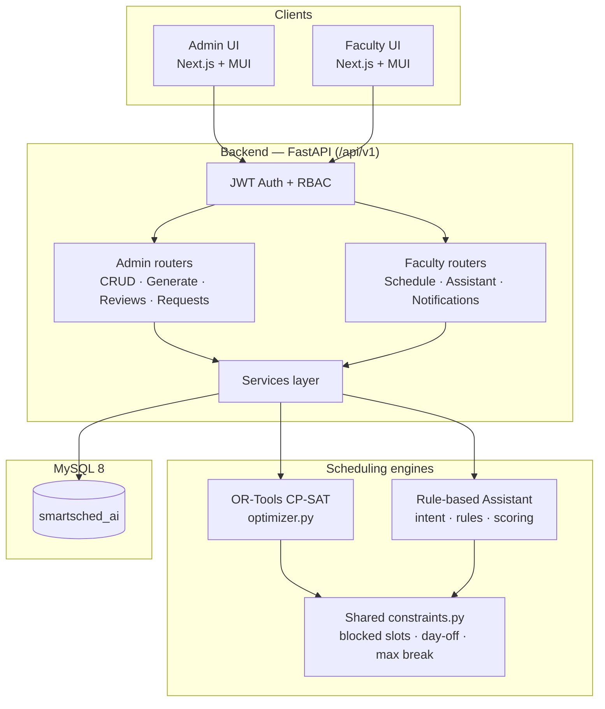

**Short explanation:** Browsers talk only to FastAPI. Business logic lives in services; the heavy scheduling math is isolated in `scheduling/` (optimizer has **no SQLAlchemy imports** — easier to test). MySQL stores master data, live `timetable_entries`, constraints, requests, reviews, notifications, and assistant query logs.

### Logical layers

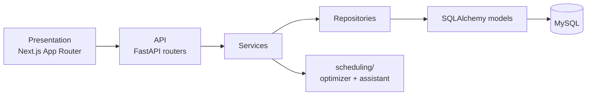

**Short explanation:** Classic layered design. UI never talks to the DB. Repositories own queries; services orchestrate transactions (generate → persist → reset reviews; confirm → pending request; approve → insert entry + notify).

### Deployment topology (local / demo)

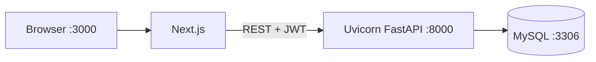

---

## 3. Feature Architectures

### 3.1 Timetable generation

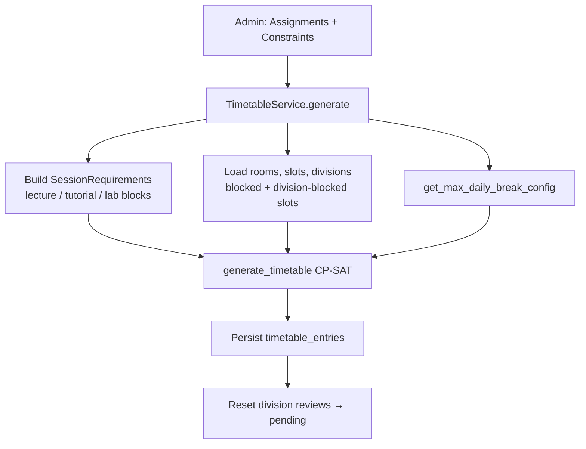

**Short explanation:** Assignments define *what* must be taught; constraints define *what is forbidden*; CP-SAT chooses *when/where*. Reviews start pending so admin must accept each division’s grid.

### 3.2 Smart Scheduling Assistant

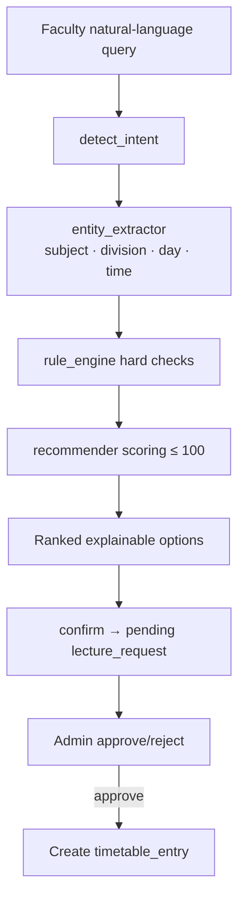

**Short explanation:** Pipeline is deterministic. Confirm does **not** write the grid immediately — it opens an approval ticket with the recommended slot/room/score.

### 3.3 Division timetable review

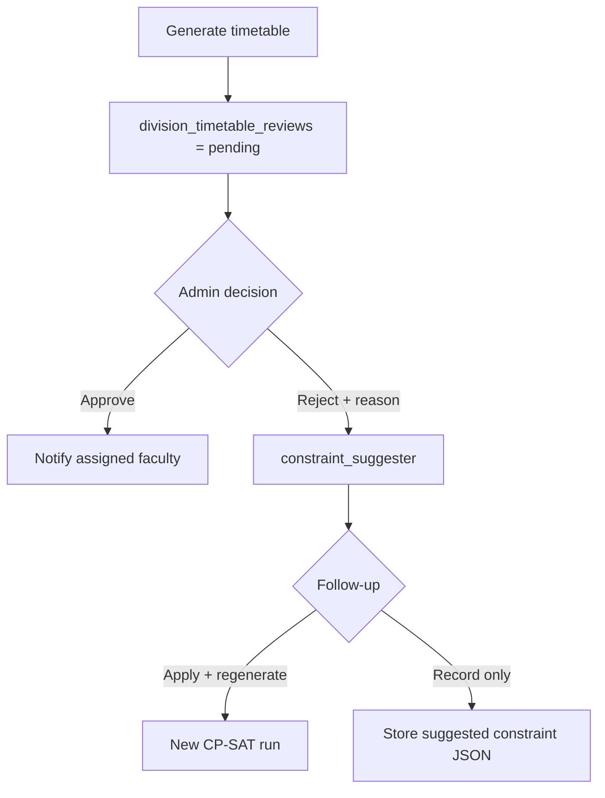

**Short explanation:** Closes the loop between human judgment and machine search: rejection text can become a draft constraint the optimizer will honor on the next run.

### 3.4 Lecture requests (manual + assistant)

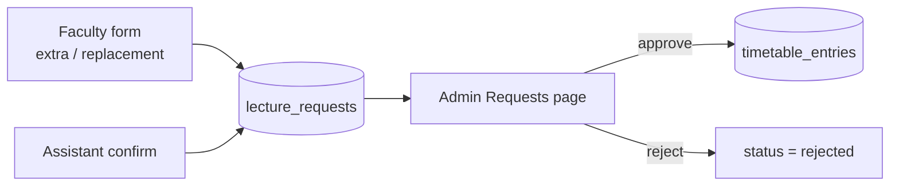

---

## 4. Use Case Diagram

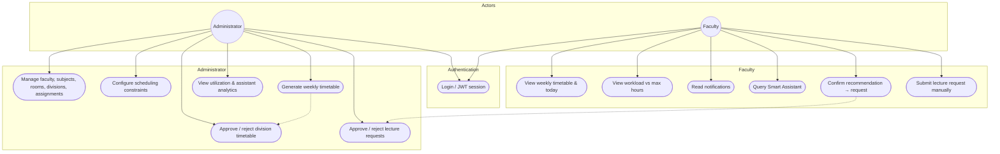

**Short explanation:** Two actors share login. Admin owns master data, generation, governance, and analytics. Faculty consumes the schedule and initiates change requests; those requests always land back with Admin.

---

## 5. Activity Diagram

### End-to-end academic scheduling cycle

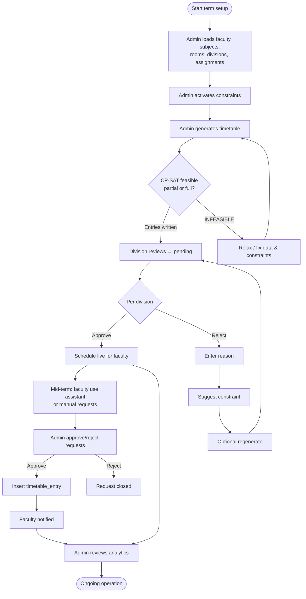

**Short explanation:** Setup → generate → review → operate. Mid-semester changes are patches under admin control, not silent grid edits.

---

## 6. Flow Diagrams & Algorithms

### 6.1 CP-SAT timetable generation (algorithm)

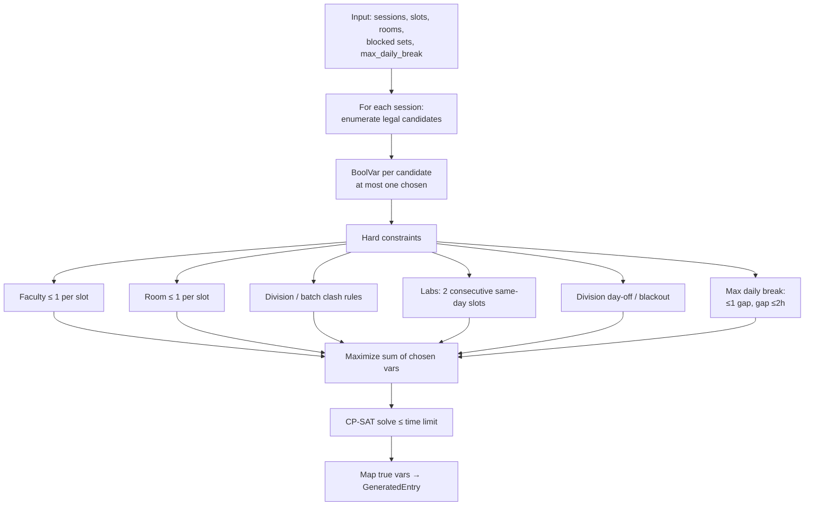

**Algorithm in brief**

| Step | What happens |
|---|---|
| Candidate generation | Filter slots (blocked, division blackout), match room type & capacity; labs need consecutive `slot_order`; online → `room_id = null` |
| Decision variables | One Boolean per (session, candidate); at most one true per session |
| Hard constraints | No double-booking; lab pairing; free-hour / day-off filters already removed illegal candidates; `max_daily_break` adds occupancy/gap constraints per division-day |
| Objective | Maximize number of scheduled sessions (prefer useful partial grids) |
| Solver | Google OR-Tools CP-SAT, multi-worker, wall-clock time limit |

**Enforced constraint types today:** `faculty_free_hour`, `division_day_off`, `division_blackout`, `max_daily_break`.  
**Stored but not yet in the solver:** `max_continuous_hours`, `lab_continuous_hours`, `online_year`, free-form `custom`.

### 6.2 Smart Assistant pipeline (algorithm)

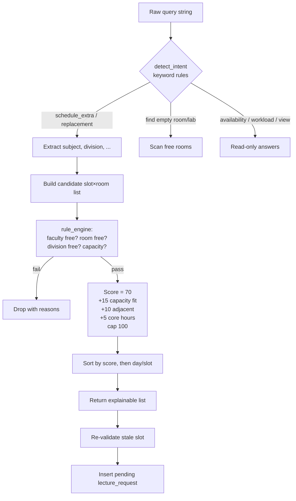

**Scoring (deterministic)**

| Points | Rule |
|---|---|
| 70 | Base — all hard checks passed |
| +15 | Room capacity within ~20% of division strength |
| +10 | Slot adjacent to an existing class that day (less idle time) |
| +5 | Not the first/last teaching period of the day |
| ≤100 | Cap; ties broken by earliest day, then slot order |

### 6.3 Admin approve lecture request

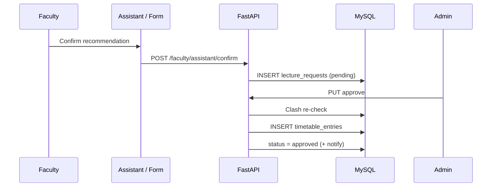

---

## 7. How Each Feature Works (In Words)

### Master data (Admin CRUD)

Admin maintains faculty (with login accounts), subjects (weekly lecture/tutorial/lab load), rooms (classroom / laboratory / tutorial), divisions (and batches for labs), and **subject–faculty–division assignments**. Assignments are the optimizer’s demand list: each assignment expands into the required number of weekly sessions.

### Constraints

Constraints are rows in `scheduling_constraints` with a `constraint_type` and JSON `config` (e.g. Friday 1–2 free hour; TY-D Monday+Saturday blackout; max one break of 2 hours). Active constraints are loaded once and applied consistently in generation and (where relevant) assistant checks.

### Timetable generation

On **Generate**, the service expands assignments → sessions, seeds the weekly time grid if needed, loads rooms/divisions, builds the CP-SAT model, solves, soft-clears previous term entries as designed, writes new `timetable_entries`, and marks each affected division’s review as **pending**. Faculty see data as soon as entries exist; governance still expects admin review.

### Division review

Admin opens Timetable → reviews each division. **Approve** notifies faculty that the grid is accepted. **Reject** requires a reason; a rule-based suggester may propose a concrete constraint (day-off, blackout, free hour). Admin can apply and regenerate so the next CP-SAT run respects the new rule.

### Faculty schedule & workload

Faculty UIs read `timetable_entries` filtered by the logged-in faculty profile: today, full week, and hours vs `max_weekly_hours`.

### Smart Assistant

Faculty type a request in natural language. Intent keywords classify the ask; entities are matched against DB names/codes (substring/regex — synonyms like “DBMS” vs full title may miss). Feasible (slot, room) pairs are hard-filtered, scored, and shown with reasons. Confirm creates a **pending** lecture request carrying the recommended slot/room/score for admin.

### Lecture requests

Whether from the assistant or the manual form, requests wait in Admin → Requests. Approval re-validates clashes and inserts a timetable entry; rejection only updates status.

### Notifications & analytics

Review outcomes and related events create in-app notifications. Analytics aggregate real utilization, student idle gaps, and assistant intent usage from logs — not synthetic KPIs.

---

## 8. Suggested Improvements

These are practical next steps (aligned with honesty about current limits):

| Priority | Improvement | Why |
|---|---|---|
| High | Enforce `max_continuous_hours` / `lab_continuous_hours` in CP-SAT | Schema already exists; closes the biggest “stored but ignored” gap |
| High | Soft objective: minimize idle gaps + balance faculty load | Complements hard `max_daily_break`; better quality when many solutions exist |
| Medium | Fuzzy subject matching / synonym dictionary for assistant | Fixes “DBMS” ≠ “Database Management Systems” |
| Medium | Timetable versioning + rollback | Safer regenerations mid-term |
| Medium | Email/SMS on approve/reject | Faculty don’t live in the portal |
| Medium | Browser e2e (Playwright) for generate → review → assistant → approve | Complements pytest/Vitest |
| Low | Student read-only portal | Demand exists; out of current RBAC |
| Low | Docker Compose for one-command demo | Easier external evaluation |
| Low | Export PDF/Excel of division grids | Common academic office need |

---

## 9. Tech Stack

| Layer | Technology |
|---|---|
| Frontend | Next.js 15 (App Router) · TypeScript · MUI · Axios · React Hook Form · Zod · TanStack Query · Vitest |
| Backend | Python ≥ 3.10 · FastAPI · Uvicorn · Pydantic Settings |
| ORM / DB | SQLAlchemy 2 · PyMySQL · **MySQL 8** |
| Auth | JWT (python-jose) · bcrypt · RBAC `admin` \| `faculty` |
| Optimization | **Google OR-Tools CP-SAT** |
| Assistant | Deterministic intent + rules + scoring (**no LLM**) |
| Tooling | ESLint · Prettier · Husky (frontend) · pytest (backend) |

> No Docker and no external LLM APIs in the current design.  
> Frontend was migrated from Create React App to Next.js 15 — see `frontend/README.md`.

---

## 10. Build Status

| Phase | Status | Notes |
|---|---|---|
| 1. Frontend | ✅ Done | Next.js 15 App Router |
| 2. Database | ✅ Done | Schema + migrations through `012_max_daily_break` |
| 3. Authentication | ✅ Done | JWT + RBAC + Next middleware |
| 4. Admin module | ✅ Done | CRUD, assignments, constraints, requests, reviews |
| 5. Faculty module | ✅ Done | Schedule, workload, notifications, assistant |
| 6. Timetable engine | ✅ Done | OR-Tools CP-SAT + shared constraints |
| 7. Rule-based assistant | ✅ Done | Intent → rules → score → pending request |
| 8. Analytics | ✅ Done | Real DB metrics |
| 9. Testing | ✅ Done | Backend pytest + frontend Vitest (unit/component) |
| 10. Deployment | ⬜ Not started | |

---

## 11. Setup & Run

### Prerequisites

- Node.js ≥ 18.18 and npm ≥ 9  
- Python ≥ 3.10  
- MySQL Server ≥ 8.0  
- Git  

### Clone

```bash
git clone https://github.com/<your-org>/smartsched-ai.git
cd smartsched-ai
```

### Environment variables

`backend/.env` (from `backend/.env.example`):

```env
DB_HOST=localhost
DB_PORT=3306
DB_NAME=smartsched_ai
DB_USER=root
DB_PASSWORD=your_mysql_password

JWT_SECRET_KEY=your_super_secret_key
JWT_ALGORITHM=HS256
JWT_ACCESS_TOKEN_EXPIRE_MINUTES=60

APP_ENV=development
BACKEND_CORS_ORIGINS=http://localhost:3000
```

`frontend/.env.local`:

```env
NEXT_PUBLIC_API_BASE_URL=http://localhost:8000/api/v1
```

### Database

```sql
CREATE DATABASE smartsched_ai CHARACTER SET utf8mb4 COLLATE utf8mb4_unicode_ci;
```

```bash
mysql -u root -p smartsched_ai < database/schema/001_create_tables.sql
mysql -u root -p smartsched_ai < database/seed/seed_data.sql
# Then apply migrations under database/migrations/ in numeric order (002 … 012)
```

See `database/README.md` and `database/docs/er-diagram.md` for ER detail.

### Backend

```bash
cd backend
python -m venv venv
# Windows: venv\Scripts\activate
source venv/bin/activate
pip install -r requirements.txt
uvicorn app.main:app --reload --host 0.0.0.0 --port 8000
```

- API: http://localhost:8000  
- Swagger: http://localhost:8000/docs  

### Frontend

```bash
cd frontend
npm install
npm run dev
```

- App: http://localhost:3000  

### Demo accounts (seed)

| Role | Email | Password |
|---|---|---|
| Admin | `admin@college.edu` | `Admin@123` |
| Faculty | `jsmith@college.edu` | `Faculty@123` |

### Suggested first walkthrough

1. Admin → verify Faculty / Subjects / Rooms / Divisions / Assignments.  
2. Admin → Constraints (e.g. free hour, max daily break).  
3. Admin → Timetable → **Generate** → review each division.  
4. Faculty → Timetable / Today / Assistant (“Schedule an extra … lecture”).  
5. Admin → Requests → approve → faculty sees the new slot.

---

## 12. Folder Structure

```
smartsched-ai/
├── backend/
│   ├── app/
│   │   ├── main.py
│   │   ├── api/v1/routers/          # auth, admin_*, faculty_*
│   │   ├── core/                    # JWT, security
│   │   ├── models/ · schemas/ · repositories/ · services/
│   │   └── scheduling/
│   │       ├── optimizer.py         # CP-SAT (DB-free)
│   │       ├── constraints.py       # Shared institutional rules
│   │       ├── constraint_suggester.py
│   │       └── assistant/           # intent · extract · rules · score
│   ├── tests/
│   └── requirements.txt
├── frontend/
│   └── src/app/                     # admin/ · faculty/ · login/
├── database/
│   ├── schema/ · seed/ · migrations/ · docs/
├── readme.md
└── LICENSE
```

More detail: `backend/README.md`, `frontend/README.md`, `database/README.md`.

---

## 13. API Overview

Base path: **`/api/v1`**. Full docs at `/docs`.

| Group | Base path | Purpose |
|---|---|---|
| Auth | `/auth` | Login, `/me` |
| Admin dashboard / analytics | `/admin/dashboard`, `/admin/analytics` | Counts & metrics |
| Admin CRUD | `/admin/faculty`, `/subjects`, `/rooms`, `/divisions`, `/constraints`, `/assignments` | Master data |
| Admin timetable | `/admin/timetable` | Generate, list, division reviews |
| Admin requests | `/admin/lecture-requests` | Approve / reject |
| Faculty schedule | `/faculty/me/schedule/today`, `/timetable`, `/workload` | Personal views |
| Faculty notifications | `/faculty/notifications` | List / mark read |
| Faculty requests | `/faculty/lecture-requests` | Submit / history |
| Assistant | `/faculty/assistant/query`, `/confirm` | Recommend + open pending request |

---

## 14. Testing

**Backend**

```bash
cd backend
pip install -r requirements-dev.txt
# setup test DB per backend/README.md
pytest
```

**Frontend**

```bash
cd frontend
npm run test
```

Scoped as unit/component tests (not full browser e2e).

---

## 15. Future Scope

- Student-facing timetable portal  
- Mobile app for faculty  
- Automated substitute suggestion on leave  
- Multi-campus / multi-department tenancy  
- Timetable versioning and rollback  
- Push notifications (email / SMS)  
- Soft multi-objective optimization (idle + workload) inside CP-SAT  

---

## 16. Contributors

| Name | Role |
|---|---|
| _Add your name_ | Project Lead / Full Stack |
| _Add teammate_ | Backend |
| _Add teammate_ | Frontend |

---

## 17. License

MIT — see [LICENSE](./LICENSE).
